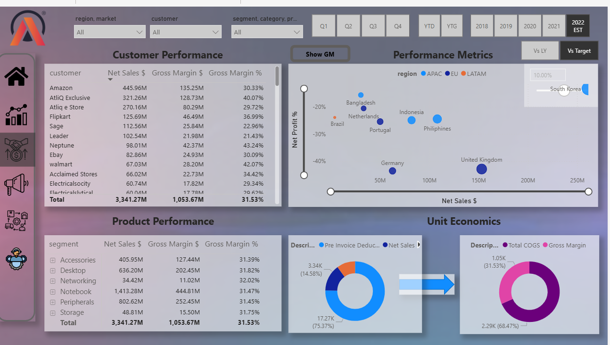
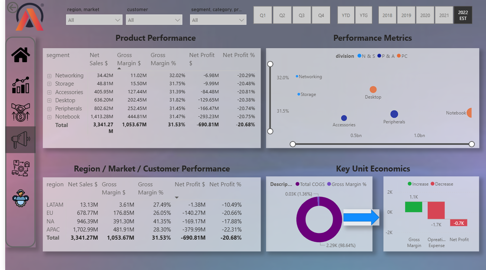
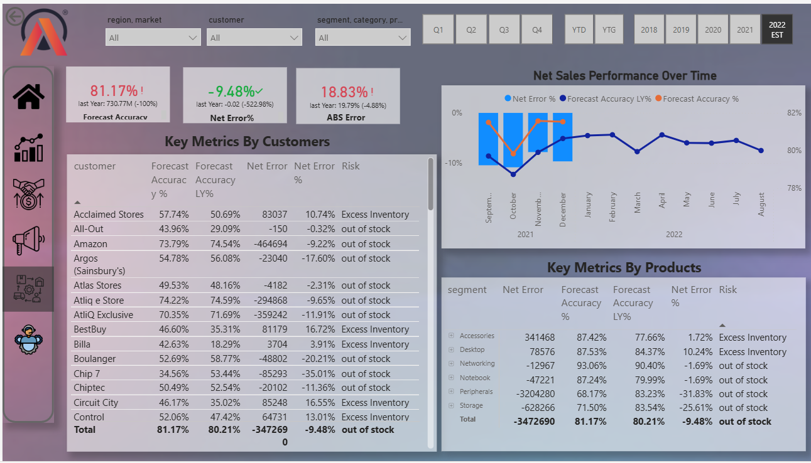
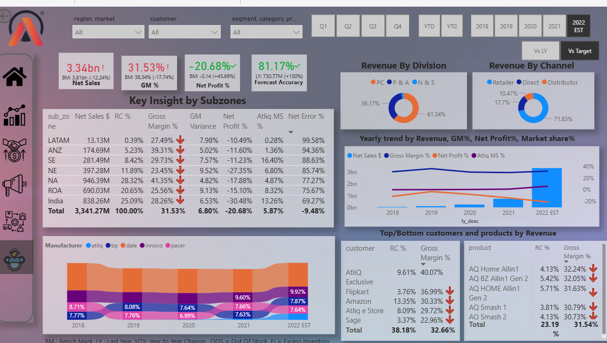

# BI360 – Power BI Project

📊 **Project Overview**  
BI360 is a comprehensive Power BI project developed using a dataset of over **1 million records** from **Atliq Hardware**. The project transforms raw data into actionable insights across Finance, Sales, Marketing, Supply Chain, and Executive functions.

---

## 🏢 About Atliq Hardware
Atliq Hardware manufactures and distributes computer hardware products. The project analyzes performance data to support data-driven decision-making.

---

## 🌐 Live Dashboard
🔗 [Click here to view the live Power BI Dashboard](https://app.powerbi.com/view?r=eyJrIjoiMTMzNDlhZDEtYTBiNC00ZmJjLWE0ZTEtZmU4ZjM2NDgwYmE4IiwidCI6ImM2ZTU0OWIzLTVmNDUtNDAzMi1hYWU5LWQ0MjQ0ZGM1YjJjNCJ9)

---

## 💡 Key Learnings
- Power BI essentials: Power Query, DAX, Data Modeling, Visualization  
- Designing **interactive dashboards** for impactful storytelling  
- Managing BI projects from **scoping to deployment**  
- Optimizing reports using **DAX Studio**  
- Communicating insights with business stakeholders  
- Exposure to **Finance, Sales, Marketing, Supply Chain & Executive** functions  
- Developing a **problem-solving and analytical mindset**

---

## 🛠 Tools & Skills Applied
- Power BI  
- SQL  
- Power Query  
- DAX & DAX Studio  
- Project Management

---

## 📊 Dashboard Views

### Finance View
- Profit & Loss (P&L)  
- Net Sales trends  
- Top Customers & Products  
- Profitability analysis  

---

### Sales View
- Customer & Product performance  
- Gross Margin % & Unit Economics  

---

### Marketing View
- Regional & Segment insights  
- GM%, NP%, Operational Expenses  

---

### Supply Chain View
- Forecast Accuracy  
- Net Error & ABS Error  
- Product & Customer trends  

---

### Executive View
- Consolidated overview of Finance, Sales, Marketing & Supply Chain  
- Key KPIs for decision-making at management level  

---

## 💡 Project Experience
Initially, dashboards focused on **year-over-year comparisons**, but stakeholder feedback emphasized measuring **targets vs. actuals**. Reworking the dashboards enhanced my understanding of asking the right questions and aligning analysis with business needs, showing the role of analytics in solving **real business challenges**.

---

## 📈 Outcomes
- Clear visibility into **top-performing customers & products**  
- Deeper **financial insights** with P&L and profitability metrics  
- Better tracking of **targets vs. actuals**  
- Improved **supply chain analysis** with forecast accuracy  
- Stronger alignment of dashboards with **business goals**

---

## 🙋 About Me
I am **Riya Arvadia**, a data enthusiast with a passion for transforming raw data into actionable business insights. This project helped me strengthen my Power BI, SQL, and analytical skills, while also developing a deeper understanding of business functions across Finance, Sales, Marketing, and Supply Chain.

---

## 🚀 Future Enhancements
- Add **dynamic KPI cards** for real-time performance tracking  
- Integrate **predictive analytics** using Python or R for forecasting trends  
- Include **interactive drill-through reports** for detailed insights  
- Enhance **mobile responsiveness** for dashboards  
- Implement **data alerts** for significant KPI changes

---

## 🙏 Acknowledgements
Thanks to **Dhaval Patel, Hemanand Vadivel, and Codebasics** for their guidance and inspiration throughout this journey.

---

## 🔗 Hashtags
#PowerBI #DataAnalytics #BusinessIntelligence #Codebasics #DataVisualization #SupplyChain #Finance #Sales #Marketing
